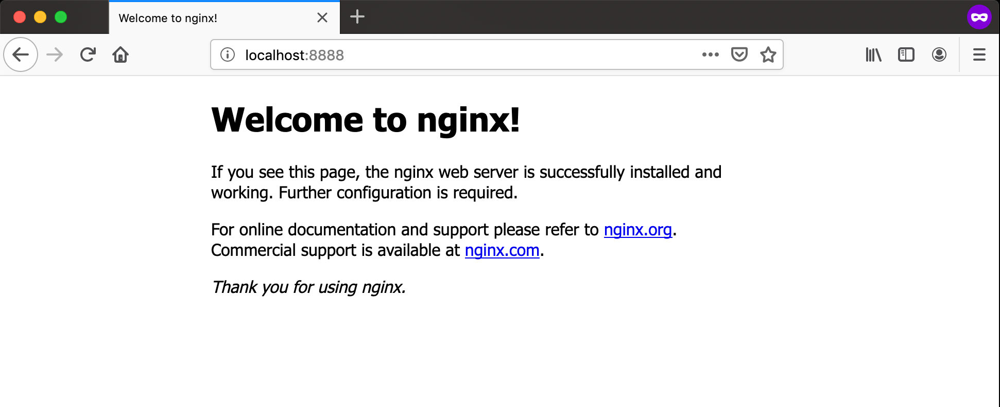
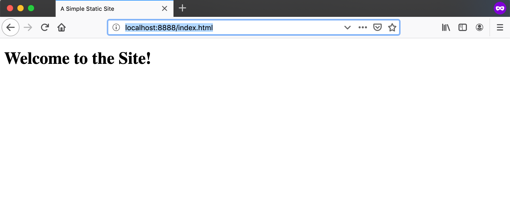
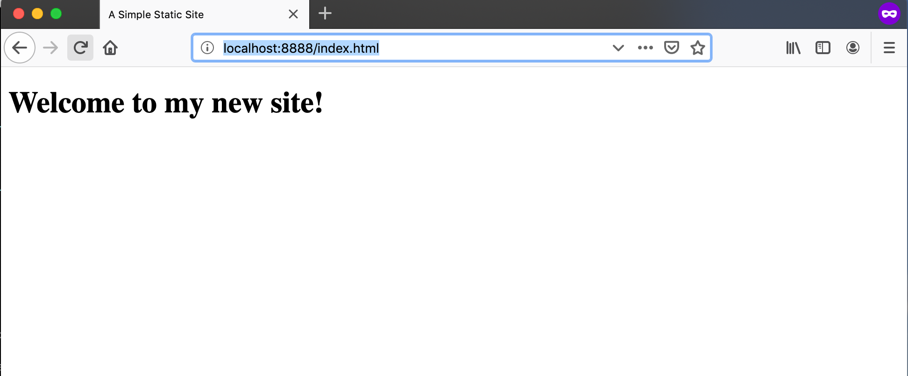
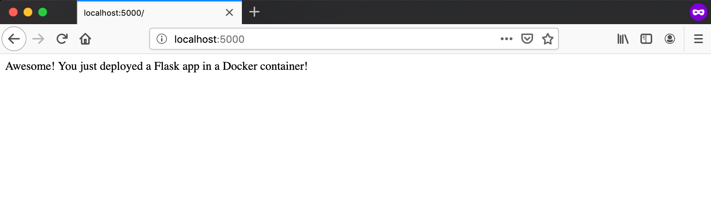
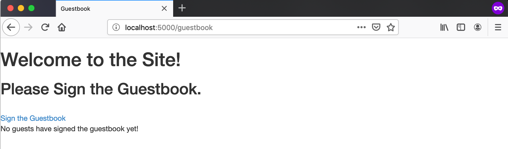
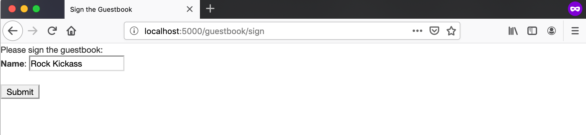
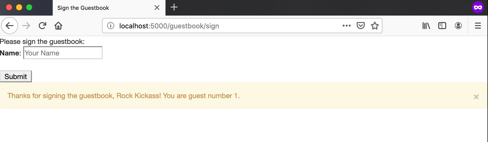
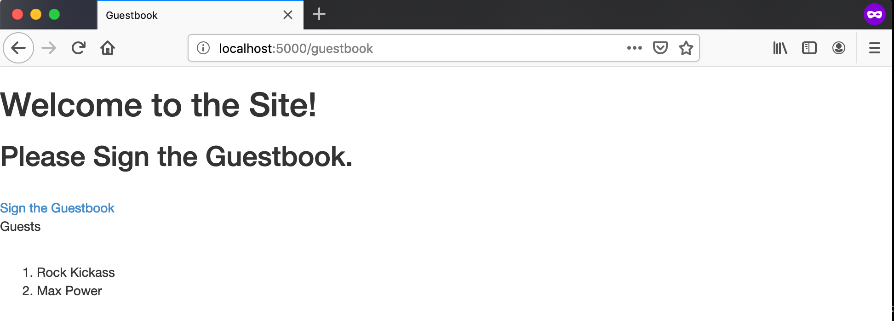

# docker-workshop
Content for the Docker Learning Workshop

## Table of Contents

* [Overview](#overview)
* [Session 1: Getting Started with Docker](#getting-started-with-docker)
* [Session 2: Drupal Developer for a Day](#drupal-developer-for-a-day)
* [Session 3: Build your own Guestbook Container Stack](#build-your-own-guestbook-container-stack)


## Overview

The Docker workshop is broken into three separate sections. Each section is
designed such that it should take about an hour to complete. Each subsequent
section builds on the previous section as well so it is recommended to complete
each section in order if you are not very familar with Docker and containers. If
you are already familiar with Docker, you will likely be able to complete these
workshops sections much more quickly.

## Prerequisites

To work through all of the sessions in this workshop, you will need the following.

* A Linux (CentOS, Ubuntu, Debian or Fedora), Windows 10 or MacOS VM or laptop.
* A working Git client
    * Information on installing a git client can be found [here](https://git-scm.com/book/en/v2/Getting-Started-Installing-Git).
* A cloned copy of this repo.

## Getting Started with Docker

In this session, we will get Docker and docker-compose installed on your laptop
or VM and gain familiarity with the Docker CLI by performing a variety of small
tasks. It may be useful to pair up with others that are running through the
workshop on the  same operating systems so that you can help each other through
any OS-specific issues you may encounter.

### 1. Install Docker on your laptop

Before we can play around with Docker we need to get Docker installed locally.
The Docker installation steps change depending on your operating system. See
the section below that corresponds to your OS to find more information on how
to install Docker.

#### Installing Docker on Linux

Docker-CE may be easily installed from package repositories on CentOS, Debian,
Fedora and Ubuntu systems. Please see the specific installation instructions
for your Linux distribution on [this page](https://docs.docker.com/install/).

docker-compose may be installed on Linux by following the instructions on
[this page](https://docs.docker.com/compose/install/).

#### Installing Docker on Mac

Install Docker Desktop for Mac. See [this page](https://docs.docker.com/docker-for-mac/install/)
for detailed installation instructions.

docker-compose is automatically installed alongside Docker Desktop for Mac.

#### Installing Docker on Windows 10

Install Docker Desktop for Windows. See [this page](https://docs.docker.com/docker-for-windows/install/)
for detailed installation instructions.

docker-compose is automatically installed alongside Docker Desktop for Windows.

### 2. Verify your Docker installation

The Docker and docker-compose installation may be verified by running the
following commands in a command line terminal.

```bash
# Verify that Docker is working correctly.
$ docker run hello-world:latest
Unable to find image 'hello-world:latest' locally
latest: Pulling from library/hello-world
1b930d010525: Pull complete
Digest: sha256:6540fc08ee6e6b7b63468dc3317e3303aae178cb8a45ed3123180328bcc1d20f
Status: Downloaded newer image for hello-world:latest

Hello from Docker!
This message shows that your installation appears to be working correctly.

To generate this message, Docker took the following steps:
 1. The Docker client contacted the Docker daemon.
 2. The Docker daemon pulled the "hello-world" image from the Docker Hub.
    (amd64)
 3. The Docker daemon created a new container from that image which runs the
    executable that produces the output you are currently reading.
 4. The Docker daemon streamed that output to the Docker client, which sent it
    to your terminal.

To try something more ambitious, you can run an Ubuntu container with:
 $ docker run -it ubuntu bash

Share images, automate workflows, and more with a free Docker ID:
 https://hub.docker.com/

For more examples and ideas, visit:
 https://docs.docker.com/get-started/

# Verify that docker-compose is installed and available.
$ docker-compose --version
docker-compose version 1.23.2, build 1110ad01
```

### 3. First Steps with Docker

In verifying your Docker installation, you've already pulled a public Docker
image, `hello-world:latest`, and run a container based on that image. You can
view the public `hello-world:latest` image on Dockerhub [here](https://hub.docker.com/_/hello-world)
and you can find more information about this image [here](https://docs.docker.com/samples/library/hello-world/).
Take a moment to look over these pages as well as the [Git repo](https://github.com/docker-library/hello-world)
where the `hello-world` Dockerfiles are found.

If we run `docker ps` we should see that we don't have any other containers
running at the moment. If we run `docker ps -a`, we should see that there is
one exited container that was based on the `hello-world:latest` image.

```bash
# Show running containers.
$ docker ps
CONTAINER ID        IMAGE                        COMMAND                  CREATED             STATUS                     PORTS                                 NAMES

# Show running and stopped containers.
$ docker ps -a
CONTAINER ID        IMAGE                        COMMAND                  CREATED             STATUS                     PORTS                                 NAMES
0865bba82190        hello-world:latest           "/hello"                 7 minutes ago       Exited (0) 7 minutes ago                                         blissful_colden
```

The output of `docker ps -a` provides us with several important pieces of information
about our `hello-world` container. We can see that the ID of the container is
`0865bba82190` and that Docker autogenerated the name `blissful_colden` for the container.
The container ID is used to uniquely identify the container in Docker and the container
name can be used to reference the container in a more human-readable way. Docker commands
that target a container typically require either the container's ID or it's name.
Generally, it is safer to rely on container IDs as they are guaranteed unique identifiers.
In the `docker ps -a` output, we also see that the container was based off of the
`hello-world:latest` image and that the container executed the command `"/hello"`
and exited with an exit code of 0 about 7 minutes ago. When you run a container,
it's always a good idea to the check the container's status via `docker ps` to
ensure that is running as you expect.

When we ran our `hello-world:latest` container, we saw a hello message from
Docker that verified that our Docker installation is running correctly that was
printed to stdout in our terminal. If we run `docker logs` with the name or ID
of our container, we should be able to see that output again.

```bash
# Get the logs by ID.
$ docker logs 0865bba82190

Hello from Docker!
This message shows that your installation appears to be working correctly.

To generate this message, Docker took the following steps:
 1. The Docker client contacted the Docker daemon.
 2. The Docker daemon pulled the "hello-world" image from the Docker Hub.
    (amd64)
 3. The Docker daemon created a new container from that image which runs the
    executable that produces the output you are currently reading.
 4. The Docker daemon streamed that output to the Docker client, which sent it
    to your terminal.

To try something more ambitious, you can run an Ubuntu container with:
 $ docker run -it ubuntu bash

Share images, automate workflows, and more with a free Docker ID:
 https://hub.docker.com/

For more examples and ideas, visit:
 https://docs.docker.com/get-started/

# Get the logs by name.
$ docker logs blissful_colden

Hello from Docker!
This message shows that your installation appears to be working correctly.

To generate this message, Docker took the following steps:
 1. The Docker client contacted the Docker daemon.
 2. The Docker daemon pulled the "hello-world" image from the Docker Hub.
    (amd64)
 3. The Docker daemon created a new container from that image which runs the
    executable that produces the output you are currently reading.
 4. The Docker daemon streamed that output to the Docker client, which sent it
    to your terminal.

To try something more ambitious, you can run an Ubuntu container with:
 $ docker run -it ubuntu bash

Share images, automate workflows, and more with a free Docker ID:
 https://hub.docker.com/

For more examples and ideas, visit:
 https://docs.docker.com/get-started/
```

Instead of letting Docker pick a random name, we can also assign a name to our
container when we run it. This can be done by passing the `--name` option to
`docker run`. Let's try running a new `hello-world:latest` container but this
time we will name it `hello`.

```bash
# Assign a name to our container.
$ docker run --name=hello hello-world:latest

Hello from Docker!
This message shows that your installation appears to be working correctly.

To generate this message, Docker took the following steps:
 1. The Docker client contacted the Docker daemon.
 2. The Docker daemon pulled the "hello-world" image from the Docker Hub.
    (amd64)
 3. The Docker daemon created a new container from that image which runs the
    executable that produces the output you are currently reading.
 4. The Docker daemon streamed that output to the Docker client, which sent it
    to your terminal.

To try something more ambitious, you can run an Ubuntu container with:
 $ docker run -it ubuntu bash

Share images, automate workflows, and more with a free Docker ID:
 https://hub.docker.com/

For more examples and ideas, visit:
 https://docs.docker.com/get-started/

# We can now see a container with the name hello.
$ docker ps -a
CONTAINER ID        IMAGE                        COMMAND                  CREATED             STATUS                      PORTS                                 NAMES
35ef4404a0d5        hello-world:latest           "/hello"                 10 seconds ago      Exited (0) 9 seconds ago                                          hello
0865bba82190        hello-world:latest           "/hello"                 20 minutes ago      Exited (0) 20 minutes ago                                         blissful_colden

# We can use the hello name to reference the container.
$ docker logs hello

Hello from Docker!
This message shows that your installation appears to be working correctly.

To generate this message, Docker took the following steps:
 1. The Docker client contacted the Docker daemon.
 2. The Docker daemon pulled the "hello-world" image from the Docker Hub.
    (amd64)
 3. The Docker daemon created a new container from that image which runs the
    executable that produces the output you are currently reading.
 4. The Docker daemon streamed that output to the Docker client, which sent it
    to your terminal.

To try something more ambitious, you can run an Ubuntu container with:
 $ docker run -it ubuntu bash

Share images, automate workflows, and more with a free Docker ID:
 https://hub.docker.com/

For more examples and ideas, visit:
 https://docs.docker.com/get-started/
```

### 4. Containers with arguments

While the `hello-world` image is useful for getting started, most of the time we
will want our images to be able to accept specific arguments from users when
they run a container based on the image. Let's build a custom image that will
allow us to print a custom greeting depending on an argument passed to the
container.

If you look in the [command_practice](command_practice) directory, you will find
a [Dockerfile](command_practice/Dockerfile). This Dockerfile defines a simple
image that uses `echo` to print out a greeting. In this Dockerfile, the
`ENTRYPOINT` is set to use the `echo` binary and the default arguments of
`Hello` and `there,`. Those arguments form the basis of our greeting. The `CMD`
is set to `friend`, so when the container is run without any arguments, the
statement `Hello there, friend` will be printed to stdout.

Let's build an image from this Dockerfile and run a container with no arguments
to start off.

```bash
# Run in the root of the cloned repo.
# Build an image tagged greeter:latest from the Dockerfile in command_practice.
$ docker build -t greeter:latest command_practice

# Run a container based on greeter:latest with no arguments.
$ docker run greeter:latest
Hello there, friend
```

That greeting is fine and all, but we want to be able to customize the greeting.
Luckily, we are able to do this by specifying our own command when we run a
container based on the `greeter:latest` image. This is simple to do, we just
need to provide the arguments we want after the image name in the `docker run`
command. Let's try it out.

```bash
# Override the default command and use "amigo" instead.
$ docker run greeter:latest amigo
Hello there, amigo

# We can use more than just one word too!
$ docker run --rm greeter:latest compadre. How are you\?
Hello there, compadre. How are you?
```

By allowing our greeter image to accept commands, we are able to reuse this
image to create any variety of containers that print different greetings.

Suppose that you would rather use the more powerful `printf` binary to print a
greeting. It is possible to use `printf` instead of `echo` by overriding the
greeter image's entrypoint when we run a container based upon this image.

```bash
# Use printf instead of echo.
$ docker run --entrypoint=printf greeter:latest "Greetings\nand\nSalutations, my friends.\n"
Greetings
and
Salutations, my friends.
```

Note that when we override the entrypoint at runtime, we aren't able to specify
default arguments like we did in the Dockerfile. All of the needed flags and
arguments will have to be provided in the command instead.

### 5. Pull and run a vanilla OS image

Like what was done in the greeter Dockerfile, you will typically start out
with a vanilla OS image for whatever flavor of Linux you prefer when you start to
develop your own Docker images. Let's pull down a vanilla OS image and create a
container from it to get a feel for what is available in these vanilla images.
This section will focus on using the Ubuntu 18.04 image but there are also images
available for CentOS, Debian, Fedora, Alpine and other distros. Feel free to play
around with those images as well once you have completed this section.

By default, most of the vanilla Linux OS images have `/bin/bash` as their command.
If we run a container based on these images with no extra arguments or overrides,
we can start a bash shell session inside the container.

```bash
# Pull the Ubuntu 18.04 image
$ docker pull ubuntu:18.04

# Need to run with the -it options so we can attach our terminal to the
# the container's bash shell session.
$ docker run --name my-ubuntu -it ubuntu:18.04

# Now you have a bash shell session open inside the Ubuntu container!
root@a6f046d64309:/#
```

With a shell session opened, feel free to explore the filesystem and see what
binaries are available. Before exiting, try writing some data to a file via
`echo` (like is shown in the example below).

```bash
docker run -it ubuntu:18.04
root@a6f046d64309:/# hostname -f
a6f046d64309

# Many binaries that typically ship with Ubuntu are not in the Ubuntu image in
# order to save space.
root@a6f046d64309:/# vi
bash: vi: command not found
root@a6f046d64309:/# ping
bash: ping: command not found

# Can check /etc/lsb-release to view the Ubuntu release information.
root@a6f046d64309:/# cat etc/lsb-release
DISTRIB_ID=Ubuntu
DISTRIB_RELEASE=18.04
DISTRIB_CODENAME=bionic
DISTRIB_DESCRIPTION="Ubuntu 18.04.2 LTS"

# Save some text to a file
root@a6f046d64309:/# touch a_file.txt
root@a6f046d64309:/# echo "Hello from the Ubuntu container!" >> a_file.txt

# Run exit when you wish to end the bash session.
root@a6f046d64309:/# exit
exit
```

Since `/bin/bash` was the container's command and the `exit` command terminates
the shell session, our Ubuntu container exited when we exited our bash session.
Suppose we wanted to save the  data that we wrote in `/a_file.txt`. Since the
container exited, we can't just start a new shell session and read the file again
that way. Instead, we can use the `docker cp` command to copy the file out of the
stopped container and save it on our Docker host.

```bash
# Copying data out of the container.
$ docker cp my-ubuntu:/a_file.txt ./a_file.txt
$ cat a_file.txt
Hello from the Ubuntu container!
```

Like we did previously with our other containers, we can also inspect the logs
of the stopped Ubuntu container. Note that the logs display all of the commands
we ran in our shell session and their output, which is pretty handy.

```bash
$ docker logs my-ubuntu
root@a6f046d64309:/# hostname -f
a6f046d64309
root@a6f046d64309:/# vi
bash: vi: command not found
root@a6f046d64309:/# ping
bash: ping: command not found
root@a6f046d64309:/# cat etc/lsb-release
DISTRIB_ID=Ubuntu
DISTRIB_RELEASE=18.04
DISTRIB_CODENAME=bionic
DISTRIB_DESCRIPTION="Ubuntu 18.04.2 LTS"
root@a6f046d64309:/# touch a_file.txt
root@a6f046d64309:/# echo "Hello from the Ubuntu container!" >> a_file.txt
root@a6f046d64309:/# exit
exit
```

### 5. Run a long-running container

In the previous sections the containers we ran were short lived. Once the container
command completed, the container exited. Most of the time we're going to want our
containers to run long-running processes rather than short-lived ones. Let's try
running a container with a long-running process, like an NGINX web server container.

Let's pull the NGINX 1.17 image and run a container based on this image.

```bash
# Pull nginx:1.17 image from Dockerhub
$ docker pull nginx:1.17
```

Since the NGINX daemon that our web server container will run will expose a
simple web page, let's map a port on our Dockerhost to port 80 in the NGINX
container so we can view this webpage in a browser. We will also want to run
this container with the `-d` option so that it will be run in the background
as a daemonized process.

```bash
# Map port 8888 on 127.0.0.1 to port 80 in the NGINX container.
$ docker run --name my-nginx -d -p 127.0.0.1:8888:80 nginx:1.17
```

Double check that our container is running via a quick `docker ps` check.
```bash
docker ps
CONTAINER ID        IMAGE                        COMMAND                  CREATED             STATUS              PORTS                                 NAMES
e6317b26e1d2        nginx:1.17                   "nginx -g 'daemon of…"   10 seconds ago      Up 9 seconds          127.0.0.1:8888->80/tcp                my-nginx
```

Unlike our other containers, we can now see some information in the PORTs column.
We can see the port mapping from `127.0.0.1:8888` on the host to port `80` in the
container has been added.

Now that our NGINX container is running and we've mapped a port on our Docker
host to port 80 in the container, we can view the basic NGINX splash page in
the browser. To do so, navigate to `http://localhost:8888` in a web browser.
We should see the following page.



So we are able to view the basic NGINX splashpage but we don't currently have
any other pages in our site. Let's mount another simple page into an NGINX
container to add to our site. If we look in the [nginx_practice](nginx_practice) directory, we
will find a simple HTML file, [index.html](nginx_practice/index.html) that we
can mount into a new NGINX container when we run one. In Docker terminology, we
will be using a `bind-mount` type volume to mount our index.html into the NGINX
container.

```bash
# Stop the current NGINX container
$ docker stop my-nginx

# Start a new NGINX container with index.html mounted in
# Make sure you replace /full/path/to/index.html with the full system path to
# your copy of index.html.
$ docker run --name my-static-site -d -v /full/path/to/index.html:/usr/share/nginx/html/index.html:ro -p 127.0.0.1:8888:80 nginx:1.17
```

After verifying that our NGINX container started correctly via `docker ps`, we
can now navigate to `http://localhost:8888/index.html` in a browser and view our
new page. This page should look like the image below.



Now our site is starting to look more interesting! Since we have our index.html
file mounted into the NGINX container, we can continue to modify the HTML in
index.html on our Docker host and these changes will also exist within the
NGINX container. This allows us to develop our site and then easily view it. Suppose
we update the text "Welcome to the Site!" to "Welcome to my new Site!" in index.html. When
we save these changes and refresh our browser window, we should see that the
text on our site changed.



Feel free to make other changes and refresh your browser to see how the site
changes. The use of `bind-mount` volumes for Docker containers can be very
useful when using Docker containers for a variety of development purposes.

Since our NGINX container is long-lived and we don't have a shell session open
inside container, how can we run commands within the container? This is where
the `docker exec` command becomes useful. `docker exec` allows us to execute
commands within a running container. Let's run a few commands to try this out.

Suppose we wanted to view the contents of index.html within the container. We
can do this by running `cat /usr/share/nginx/html/index.html` via `docker exec`.

```bash
# Cat the index.html file inside the NGINX container.
$ docker exec my-static-site cat /usr/share/nginx/html/index.html
<!DOCTYPE html>
<html>
  <head>
    <title>A Simple Static Site</title>
  </head>
  <body>
    <div>
      <header>
        <h1>Welcome to my new site!</h1>
      </header>
    </div>
  </body>
</html>
```

Suppose we want to run many commands or look around inside the container in
more depth. We can do this by starting a bash shell within the container via
`docker exec`. We will need to include `-it` as well so that we can attach the
shell session to our terminal .

```bash
# Start a bash shell within the NGINX container
$ docker exec -it my-static-site /bin/bash

# Run some commands.
root@e6317b26e1d2:/# cd /usr/share/nginx/html/
root@e6317b26e1d2:/usr/share/nginx/html# ls -al
total 16
drwxr-xr-x 2 root root 4096 Jul 23 19:59 .
drwxr-xr-x 3 root root 4096 Jul 23 19:59 ..
-rw-r--r-- 1 root root  494 Jul 23 11:45 50x.html
-rw-r--r-- 1 root root  202 Aug 12 00:39 index.html
# You might have noticed the :ro at the end of the bind-mount declaration when
# we ran the nginx container. This mounted index.html as read-only within the
# container. This means the container cannot update the contents of the file.
# The file can only be updated outside of the container.
root@e6317b26e1d2:/usr/share/nginx/html# echo "Something" >> index.html
bash: index.html: Read-only file system
```

For old times sake, let's also check the logs of the NGINX container via `docker logs`.

```bash
$ docker logs my-static-site
172.17.0.1 - - [12/Aug/2019:00:35:21 +0000] "GET /index.html HTTP/1.1" 200 199 "-" "Mozilla/5.0 (Macintosh; Intel Mac OS X 10.14; rv:67.0) Gecko/20100101 Firefox/67.0" "-"
172.17.0.1 - - [12/Aug/2019:00:39:34 +0000] "GET /index.html HTTP/1.1" 200 202 "-" "Mozilla/5.0 (Macintosh; Intel Mac OS X 10.14; rv:67.0) Gecko/20100101 Firefox/67.0" "-"
```

These logs look a bit different that our other containers. That is because the
NGINX daemon within the container is logging to stdout instead of a log file,
which you may be more accustomed to for Linux daemons. Generally, you will want
to follow this paradigm in your own images so that `docker logs` returns all of
ther pertinent log information for your contained service.


### 6. Try it yourself!

Now that you have some Docker experience, go out and explore Dockerhub. Try to
find some images that interest you, then pull them and try running them.

If you can't think of anything to search for, here are a few interesting Docker
images you can check out:

* [Damn Vulnerable Web App](https://hub.docker.com/r/citizenstig/dvwa)
    * A purposely vulnerable PHP web app used for security and penetration testing.
* [Funbox](https://hub.docker.com/r/wernight/funbox)
    * Contains a variety of amusing command line tools.
* [Infinite Mario](https://hub.docker.com/r/pengbai/docker-supermario)
    * Play Infinite Mario in the browser.
* [Wolfenstein 3D](https://hub.docker.com/r/srenkens/wolfenstein3d)
    * Play Wolfenstein 3D in the browser.
* [Dwarf Fortress](https://hub.docker.com/r/benlubar/dwarffortress)
    * Docker image containing the Dwarf Fortress game.
* [Starcraft: Brood War](https://hub.docker.com/r/ggaic/starcraft)
   * A collection of Docker images for running Starcraft: Brood War in containers.
   * Warning: Complicated to setup.
   * A good example of the trickiness of getting graphical applications working
     in containers.
   * Was actually used for AI research. Can find the research paper [here](https://arxiv.org/abs/1801.02193).

### 7. Some Additional Activities

Here are a few additional activities to try out once you are done playing around
with the various images you found on Dockerhub.

* Try looking at the layers of an image you pulled from Dockerhub via the
  `docker history` command.
* Run `docker inspect` against a running container. Check out all of the different
  data fields that are available.
* Ping a running container from another container to get feel for Docker networking.
  Try running a `traceroute` too.
* Try cleaning up stopped containers and other components via `docker prune`.
* Check out the man page for the docker CLI.

## Drupal Developer for a Day

In this session, we will go through the deployment and usage of the Drupal 8
Docker development environment that was created for use by OU libraries Drupal
developers.

Drupal is a CMS (Content Management System), similar to Wordpress, that can be
used to deploy and manage web sites. No familiarity or previous exposure to
Drupal is required to complete this session.

### 1. Clone the drupal-8-docker-dev repo

Clone down the [drupal-8-docker-dev repo](https://github.com/OULibraries/drupal-8-docker-dev)
from Github via your Git client. This repo contains Dockerfiles and docker-compose.yml
files that can be used to spin up a Drupal 8 Docker development environment.

### 2. Understanding the components of the repo

The Drupal 8 Docker development environment consists of three separate containers,
a Drupal 8 container, a MySQL database container and an NGINX frontend web server
container.

The Drupal image is build from the Dockerfile in the `drupal` directory. This
Dockerfile extends the public Drupal 8 image by including the installation of
additional PHP modules for Drupal as well as custom scripts and files used to
customize the Drupal 8 environment. Under `drupal/resources`, you can view the
various files that are used during the image building process as well as the
environment file used when the Drupal container is instantiated.

The NGINX image is built from the Dockerfile in the `nginx` directory. Unlike the
Drupal Dockerfile, this image does not require any additional customization beyond
the public NGINX image. Under `nginx/resources`, you can view the default NGINX
server configuration file used to serve the Drupal 8 site as well as the NGINX
environment file.

The MySQL image is built fro mthe Dockerfile in the `mysql` directory. Like with
NGINX, this image does not require any additional customization beyond the public
NGINX image. Under `mysql/resources`, you can see the `init` directory and the
standard MySQL environment file. The `init` directory will be mounted into the
MySQL container at a special location `/docker-entrypoint-initdb.d`. The scripts
and SQL dumps placed in this directory will be automatically imported the first
time the MySQL container is spun up. This makes it simple to import a database
dump from an existing Drupal 8 site into a local development instance.

The `dev` directory is designed to hold a custom Drupal 8 site tree. This
directory is mounted into the Drupal 8 container when it is spun up from `docker-compose.yml`.
If you also have a DB dump, this allows you to replicate a Drupal 8 site in the
development environment.

The `docker-compose.yml` file is used to spin up a Drupal 8 development cluster
with an existing site.

The `docker-compose.vanilla.yml` file is used to spin up a vanilla Drupal 8
development cluster with no site. This may be used to develop Drupal 8 sites
from scratch.

More details on the Drupal 8 Docker development environment may be found in the
README.md file within the repo.

### 3. Deploy a vanilla Drupal 8 instance

The `docker-compose.vanilla.yml` file may be used to easily deploy a vanilla
Drupal 8 Docker development enviroment. Follow the instructions [here](https://github.com/OULibraries/drupal-8-docker-dev#using-the-vanilla-drupal-development-environment) to get a
vanilla Drupal 8 cluster spun up.

### 4. Play around with Drupal 8

Once you Drupal 8 cluster has been started, navigate to `http://localhost:8080` in
a web browser. You should see the Drupal 8 web interface. Feel free to play around
with the various tabs and features. Consider publishing a new article or page. Note
that these changes will persist across restarts of the development cluster due to
the use of persistent volumes.

### 5. Access the Drupal 8 database

Like the NGINX container, the MySQL container also has port 3306 exposed on the
loopback interface of the Docker host. This allows you to bind to the MySQL database
and run various SQL queries or perform database imports or dumps.

If interested, consider downloading a graphical SQL program, like [MySQL Workbench](https://dev.mysql.com/downloads/workbench/),
or install the MySQL command client to play around with the database.

### 6. Deploy a pre-existing site into the Drupal 8 dev environment

It is also possible to deploy an existing site into the Drupal 8 Docker development
environment. On Github there is a [Drupal 8 Umami example site repo](https://github.com/OULibraries/drupal-8-umami-example)
which can be cloned and imported into the Drupal 8 Docker development environment.
Clone this repo into the `dev` directory found in your cloned copy of the
drupal-8-docker-dev repo. Be sure to remove the `.gitkeep` file before cloning
the Umami example site repo.

Once you have cloned the Umami site, follow the instructions in the [README](https://github.com/OULibraries/drupal-8-umami-example/blob/master/README.md) to finish deploying the site. Be sure to shutdown your previous
Drupal 8 Docker development cluster with `docker-compose -f docker-compose.vanilla.yml down -v`
before spinning up a new cluster with an existing site.

Once you have redeployed the environment with an existing site, you should see
the Umami Food Blog site when you navigate to `http://localhost:8080`. Feel free
to play around with this site as well. Like before, any changes you make to the
site will be persisted if you restart the development environment.


## Build your own Guestbook Container Stack

In this session, you will build your own Dockerfiles and docker-compose.yml to
deploy a Python-based Guestbook application backed by a Redis key-value database.
You will use the pre-written guestbook Python app available under the `guestbook`
directory  and complete the skeleton Dockerfiles and docker-compose.yml in this
repository in order to deploy and use the application in Docker containers.

### 1. Build the Guestbook Image

Locate the [guestbook app's skeleton Dockerfile](guestbook/Dockerfile). This file
contains comments for all of the steps you will need to build an image to run
this application. Add Dockerfile directives beneath each comment to complete the
Dockerfile for the guestbook.

Once you have completed the Dockerfile, build an image from the Dockerfile via
`docker build`. Tag this image as `guestbook:latest`.

### 2. Run the Guestbook Container

Now that you have a completed guestbook image, run a container based on this
image via `docker run`. Be sure to run the container in the background and to
map port 5000 on your loopback interface (127.0.0.1) to port 5000 inside the
container.

Once the container is running, navigate to `http://localhost:5000/` in a browser
on your Docker host. If your container is running correctly, you will see the text
`Awesome! You just deployed a Flask app in a Docker container!` in your browser
window.



If you navigate to `http://localhost:5000/guestbook`, you should see the message
`Can't connect to Redis at localhost:6379! See logs for more details.` in your
browser window. Before we can get our guestbook up and running we'll need to
create a Redis image and container that the guestbook can use as a backend
data store.


### 3. Build the Redis Image

Now we need to build a Redis image so we can save our guestbook entries. Locate
the [redis skeleton Dockerfile](redis/Dockerfile). Like the guestbook Dockerfile,
this file contains comments for the steps you will need to take to complete the
Dockerfile for a Redis image. Utilize the publicly  available Redis official Docker
image from Dockerhub for your image. You shouldn't need to add any additional
directives to your Redis Dockerfile.

Once you have completed the Redis Dockerfile, build an image from the Dockerfile
via `docker build`. Tag this image as `guestbook_redis:latest`.

### 4. Run the Redis Container

Now that you have a completed Redis image, run a container based on this
image via `docker run`. Be sure to run the container in the background and to
map port 6379 on your loopback interface (127.0.0.1) to port 6379 inside the
container.

### 5. Connect the Guestbook app to the Redis Container

With a Redis instance up and running, we can now connect our guestbook container
to the Redis instance. If you check [guestbook.py](guestbook/app/guestbook.py#L11-L12),
you will see that the Redis connection is determined by the `REDIS_HOST` and `REDIS_PORT`
environment variables. How can you redeploy your guestbook container so that it
can connnect to the Redis instance successfully? Can you do it without updating
the Dockerfile? Keep in mind the best practices of container management when
determining your solution.

Once you have worked through how to connect the guestbook container to the Redis
container, navigate to `http://localhost:5000/guestbook`. You should no longer
see the error message about being unable to connec to Redis. You should now see
an empty guestbook and a link to a page where you can sign the guestbook. Feel
free to play around with the guestbook and sign it. Each time you enter a new
entry, it will be stored in Redis and you will see it displayed in the guestbook.

Empty Guestbook Page


Signing the Guestbook


Guestbook Sign Response


Viewing Guestbook Signatures


### 6. Complete the docker-compose.yml

While the deployment of the guestbook application stack you just went through works,
it can be tedious to stop and redeploy due to needing know the IP address of the
Redis container before the guestbook starts up. The current deployment of the
stack also doesn't preserve the guestbook signatures across restarts. We can
easily address these issue by deploying this stack via docker-compose rather
than just through regular docker commands.

Locate the [docker-compose.yml](docker-compose.yml) file in this repo. Like the
Dockerfiles, this file contains comments explaining what needs to be added to the
file in order to deploy the guestbook application stack via docker-compose.

### 7. Deploy the guestbook container stack via docker-compose

Once you have completed the docker-compose.yml, you can now spin up the entire
guestbook container stack with one `docker-compose` command. Run the necessary
command to bring up the container stack and then navigate to `http://localhost:5000`
and `http://localhost:5000/guestbook` to ensure that the application deployed
correctly. Also make sure to sign the guestbook a few times and restart the
application stack to ensure that your guestbook entries are persistant.
