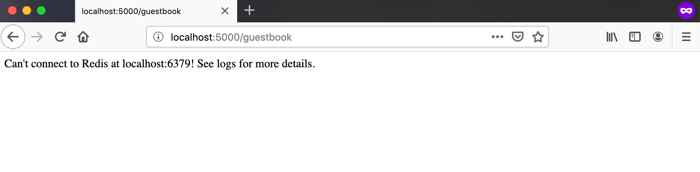

# docker-workshop
Content for the Docker Learning Workshop

## Table of Contents

* [Overview](#overview)
* [Session 1: Getting Started with Docker](#getting-started-with-docker)
* [Session 2: Drupal Developer for a Day](#drupal-developer-for-a-day)
* [Session 3: Build your own Guestbook Container Stack](#build-your-own-guestbook-container-stack)


## Overview

The Docker workshop is broken into three separate sections. Each section is
designed such that it should take about an hour to complete. Each subsequent
section builds on the previous section as well so it is recommended to complete
each section in order if you are not very familar with Docker and containers. If
you are already familiar with Docker, you will likely be able to complete these
workshops sections much more quickly.

## Prerequisites

To work through all of the sessions in this workshop, you will need the following.

* A Linux (CentOS, Ubuntu, Debian or Fedora), Windows 10 or MacOS VM or laptop.
* A working Git client
    * Information on installing a git client can be found [here](https://git-scm.com/book/en/v2/Getting-Started-Installing-Git).
* A cloned copy of this repo.

## Getting Started with Docker

In this session, we will get Docker and docker-compose installed on your laptop
or VM and gain familiarity with the Docker CLI by performing a variety of small
tasks. It may be useful to pair up with others that are running through the
workshop on the  same operating systems so that you can help each other through
any OS-specific issues you may encounter.

### Installing Docker on Linux

Docker-CE may be easily installed from package repositories on CentOS, Debian,
Fedora and Ubuntu systems. Please see the specific installation instructions
for your Linux distribution on [this page](https://docs.docker.com/install/).

docker-compose may be installed on Linux by following the instructions on
[this page](https://docs.docker.com/compose/install/).

### Installing Docker on Mac

Install Docker Desktop for Mac. See [this page](https://docs.docker.com/docker-for-mac/install/)
for detailed installation instructions.

docker-compose is automatically installed alongside Docker Desktop for Mac.

### Installing Docker on Windows 10

Install Docker Desktop for Windows. See [this page](https://docs.docker.com/docker-for-windows/install/)
for detailed installation instructions.

docker-compose is automatically installed alongside Docker Desktop for Windows.

### 2. Verify your Docker installation

The Docker and docker-compose installation may be verified by running the
following commands in a command line terminal.

```bash
# Verify that Docker is working correctly.
$ docker run hello-world:latest
Unable to find image 'hello-world:latest' locally
latest: Pulling from library/hello-world
1b930d010525: Pull complete
Digest: sha256:6540fc08ee6e6b7b63468dc3317e3303aae178cb8a45ed3123180328bcc1d20f
Status: Downloaded newer image for hello-world:latest

Hello from Docker!
This message shows that your installation appears to be working correctly.

To generate this message, Docker took the following steps:
 1. The Docker client contacted the Docker daemon.
 2. The Docker daemon pulled the "hello-world" image from the Docker Hub.
    (amd64)
 3. The Docker daemon created a new container from that image which runs the
    executable that produces the output you are currently reading.
 4. The Docker daemon streamed that output to the Docker client, which sent it
    to your terminal.

To try something more ambitious, you can run an Ubuntu container with:
 $ docker run -it ubuntu bash

Share images, automate workflows, and more with a free Docker ID:
 https://hub.docker.com/

For more examples and ideas, visit:
 https://docs.docker.com/get-started/

# Verify that docker-compose is installed and available.
$ docker-compose --version
docker-compose version 1.23.2, build 1110ad01
```

### 3. Play around with the Docker CLI

TODO

Suggested Activities
* Check the logs of the hello world container you just ran. Note how the logs
  are the same as the messages printed to STDOUT when you ran the container.
* Pull down an OS image (Ubuntu, CentOS, Debian) and run a container with a
  standard bash shell. Explore the directory structure and note which binaries
  are present or missing.
* Pull down an image and run a container in the background. Run `docker exec`s
  against this container. Run `docker exec` to launch a shell session within
  the container.
* Explore all of the different images available on Dockerhub. Pick an image
  and read through it's Dockerfile.
* Try mounting a file into a container when you run it.
* Try looking at the layers of an image you pulled from Dockerhub.
* Run `docker inspect` against a running container. Try to find it's private IP
  address. Try interacting with an exposed port on the private interface of the
  container.
* Play around with overriding the entrypoint and cmd of an image.
* Ping a running container from another container to get feel for Docker networking.
  Try running a traceroute too.
* View running and stopped containers via `docker ps`.
* Try cleaning up stopped containers and other components via `docker prune`.
* Copy data into and out of a running container with `docker cp`.
* Check out the man page for the docker CLI.

## Drupal Developer for a Day

In this session, we will go through the deployment and usage of the Drupal 8
Docker development environment that was created for use by OU libraries Drupal
developers.

Drupal is a CMS (Content Management System), similar to Wordpress, that can be
used to deploy and manage web sites. No familiarity or previous exposure to
Drupal is required to complete this session.

### 1. Clone the drupal-8-docker-dev repo

Clone down the [drupal-8-docker-dev repo](https://github.com/OULibraries/drupal-8-docker-dev)
from Github via your Git client. This repo contains Dockerfiles and docker-compose.yml
files that can be used to spin up a Drupal 8 Docker development environment.

### 2. Understanding the components of the repo

The Drupal 8 Docker development environment consists of three separate containers,
a Drupal 8 container, a MySQL database container and an NGINX frontend web server
container.

The Drupal image is build from the Dockerfile in the `drupal` directory. This
Dockerfile extends the public Drupal 8 image by including the installation of
additional PHP modules for Drupal as well as custom scripts and files used to
customize the Drupal 8 environment. Under `drupal/resources`, you can view the
various files that are used during the image building process as well as the
environment file used when the Drupal container is instantiated.

The NGINX image is built from the Dockerfile in the `nginx` directory. Unlike the
Drupal Dockerfile, this image does not require any additional customization beyond
the public NGINX image. Under `nginx/resources`, you can view the default NGINX
server configuration file used to serve the Drupal 8 site as well as the NGINX
environment file.

The MySQL image is built fro mthe Dockerfile in the `mysql` directory. Like with
NGINX, this image does not require any additional customization beyond the public
NGINX image. Under `mysql/resources`, you can see the `init` directory and the
standard MySQL environment file. The `init` directory will be mounted into the
MySQL container at a special location `/docker-entrypoint-initdb.d`. The scripts
and SQL dumps placed in this directory will be automatically imported the first
time the MySQL container is spun up. This makes it simple to import a database
dump from an existing Drupal 8 site into a local development instance.

The `dev` directory is designed to hold a custom Drupal 8 site tree. This
directory is mounted into the Drupal 8 container when it is spun up from `docker-compose.yml`.
If you also have a DB dump, this allows you to replicate a Drupal 8 site in the
development environment.

The `docker-compose.yml` file is used to spin up a Drupal 8 development cluster
with an existing site.

The `docker-compose.vanilla.yml` file is used to spin up a vanilla Drupal 8
development cluster with no site. This may be used to develop Drupal 8 sites
from scratch.

More details on the Drupal 8 Docker development environment may be found in the
README.md file within the repo.

### 3. Deploy a vanilla Drupal 8 instance

The `docker-compose.vanilla.yml` file may be used to easily deploy a vanilla
Drupal 8 Docker development enviroment. Follow the instructions [here](https://github.com/OULibraries/drupal-8-docker-dev#using-the-vanilla-drupal-development-environment) to get a
vanilla Drupal 8 cluster spun up.

### 4. Play around with Drupal 8

Once you Drupal 8 cluster has been started, navigate to `http://localhost:8080` in
a web browser. You should see the Drupal 8 web interface. Feel free to play around
with the various tabs and features. Consider publishing a new article or page. Note
that these changes will persist across restarts of the development cluster due to
the use of persistent volumes.

### 5. Access the Drupal 8 database

Like the NGINX container, the MySQL container also has port 3306 exposed on the
loopback interface of the Docker host. This allows you to bind to the MySQL database
and run various SQL queries or perform database imports or dumps.

If interested, consider downloading a graphical SQL program, like [MySQL Workbench](https://dev.mysql.com/downloads/workbench/),
or install the MySQL command client to play around with the database.

### 6. Deploy a pre-existing site into the Drupal 8 dev environment

It is also possible to deploy an existing site into the Drupal 8 Docker development
environment. On Github there is a [Drupal 8 Umami example site repo](https://github.com/OULibraries/drupal-8-umami-example)
which can be cloned and imported into the Drupal 8 Docker development environment.
Clone this repo into the `dev` directory found in your cloned copy of the
drupal-8-docker-dev repo. Be sure to remove the `.gitkeep` file before cloning
the Umami example site repo.

Once you have cloned the Umami site, follow the instructions in the [README](https://github.com/OULibraries/drupal-8-umami-example/blob/master/README.md) to finish deploying the site. Be sure to shutdown your previous
Drupal 8 Docker development cluster with `docker-compose -f docker-compose.vanilla.yml down -v`
before spinning up a new cluster with an existing site.

Once you have redeployed the environment with an existing site, you should see
the Umami Food Blog site when you navigate to `http://localhost:8080`. Feel free
to play around with this site as well. Like before, any changes you make to the
site will be persisted if you restart the development environment.


## Build your own Guestbook Container Stack

In this session, you will build your own Dockerfiles and docker-compose.yml to
deploy a Python-based Guestbook application backed by a Redis key-value database.
You will use the pre-written guestbook Python app available under the `guestbook`
directory  and complete the skeleton Dockerfiles and docker-compose.yml in this
repository in order to deploy and use the application in Docker containers.

### 1. Build the Guestbook Image

Locate the [guestbook app's skeleton Dockerfile](guestbook/Dockerfile). This file
contains comments for all of the steps you will need to build an image to run
this application. Add Dockerfile directives beneath each comment to complete the
Dockerfile for the guestbook.

Once you have completed the Dockerfile, build an image from the Dockerfile via
`docker build`. Tag this image as `guestbook:latest`.

### 2. Run the Guestbook Container

Now that you have a completed guestbook image, run a container based on this
image via `docker run`. Be sure to run the container in the background and to
map port 5000 on your loopback interface (127.0.0.1) to port 5000 inside the
container.

Once the container is running, navigate to `http://localhost:5000/` in a browser
on your Docker host. If your container is running correctly, you will see the text
`Awesome! You just deployed a Flask app in a Docker container!` in your browser
window.


If you navigate to `http://localhost:5000/guestbook`, you should see the message
`Can't connect to Redis at localhost:6379! See logs for more details.` in your
browser window. Before we can get our guestbook up and running we'll need to
create a Redis image and container that the guestbook can use as a backend
data store.



### 3. Build the Redis Image

Now we need to build a Redis image so we can save our guestbook entries. Locate
the [redis skeleton Dockerfile](redis/Dockerfile). Like the guestbook Dockerfile,
this file contains comments for the steps you will need to take to complete the
Dockerfile for a Redis image. Utilize the publicly  available Redis official Docker
image from Dockerhub for your image. You shouldn't need to add any additional
directives to your Redis Dockerfile.

Once you have completed the Redis Dockerfile, build an image from the Dockerfile
via `docker build`. Tag this image as `guestbook_redis:latest`.

### 4. Run the Redis Container

Now that you have a completed Redis image, run a container based on this
image via `docker run`. Be sure to run the container in the background and to
map port 6379 on your loopback interface (127.0.0.1) to port 6379 inside the
container.

### 5. Connect the Guestbook app to the Redis Container

With a Redis instance up and running, we can now connect our guestbook container
to the Redis instance. If you check [guestbook.py](guestbook/app/guestbook.py#L11-L12),
you will see that the Redis connection is determined by the `REDIS_HOST` and `REDIS_PORT`
environment variables. How can you redeploy your guestbook container so that it
can connnect to the Redis instance successfully? Can you do it without updating
the Dockerfile? Keep in mind the best practices of container management when
determining your solution.

Once you have worked through how to connect the guestbook container to the Redis
container, navigate to `http://localhost:5000/guestbook`. You should no longer
see the error message about being unable to connec to Redis. You should now see
an empty guestbook and a link to a page where you can sign the guestbook. Feel
free to play around with the guestbook and sign it. Each time you enter a new
entry, it will be stored in Redis and you will see it displayed in the guestbook.

Empty Guestbook Page


Signing the Guestbook


Guestbook Sign Response


Viewing Guestbook Signatures


### 6. Complete the docker-compose.yml

While the deployment of the guestbook application stack you just went through works,
it can be tedious to stop and redeploy due to needing know the IP address of the
Redis container before the guestbook starts up. The current deployment of the
stack also doesn't preserve the guestbook signatures across restarts. We can
easily address these issue by deploying this stack via docker-compose rather
than just through regular docker commands.

Locate the [docker-compose.yml](docker-compose.yml) file in this repo. Like the
Dockerfiles, this file contains comments explaining what needs to be added to the
file in order to deploy the guestbook application stack via docker-compose.

### 7. Deploy the guestbook container stack via docker-compose

Once you have completed the docker-compose.yml, you can now spin up the entire
guestbook container stack with one `docker-compose` command. Run the necessary
command to bring up the container stack and then navigate to `http://localhost:5000`
and `http://localhost:5000/guestbook` to ensure that the application deployed
correctly. Also make sure to sign the guestbook a few times and restart the
application stack to ensure that your guestbook entries are persistant.
